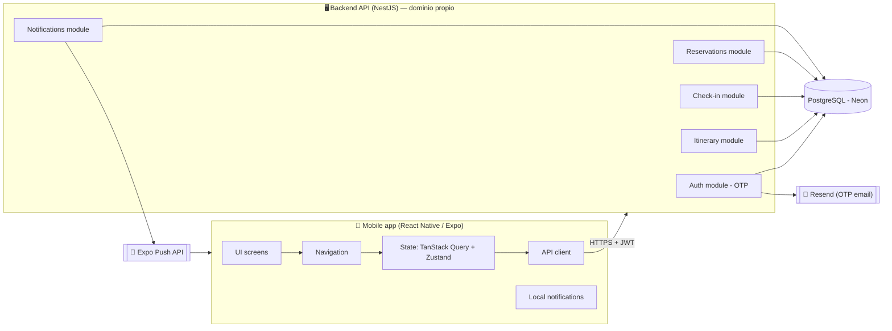
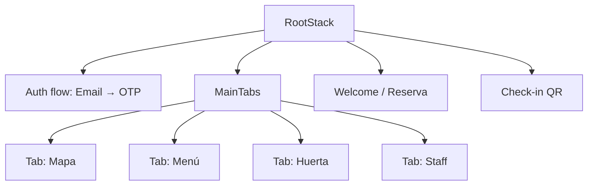
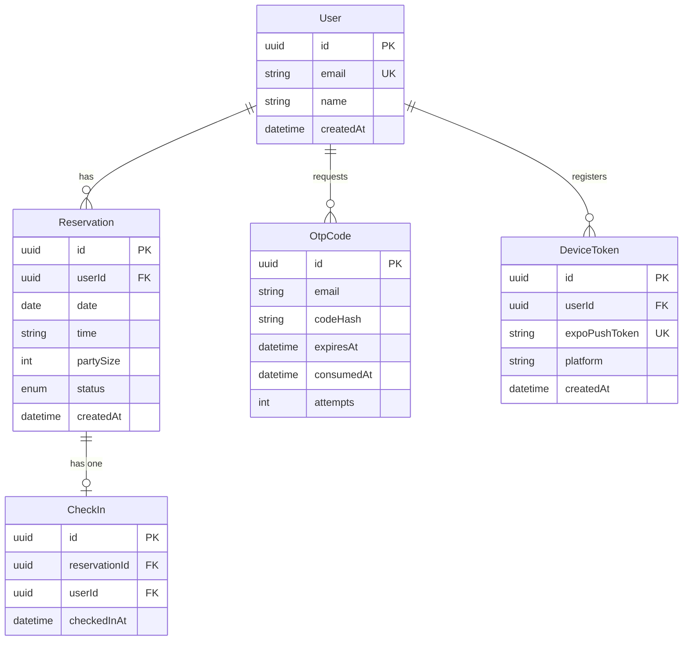
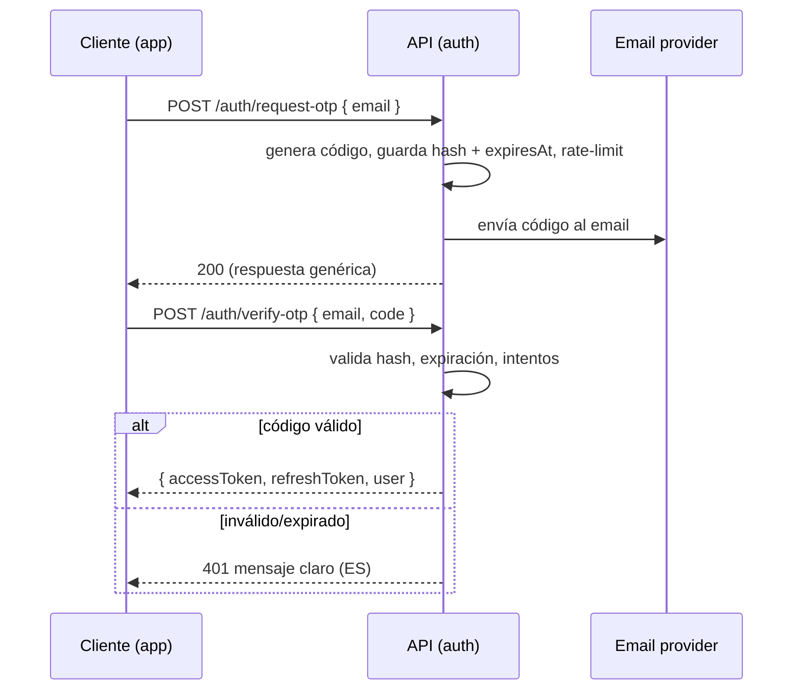
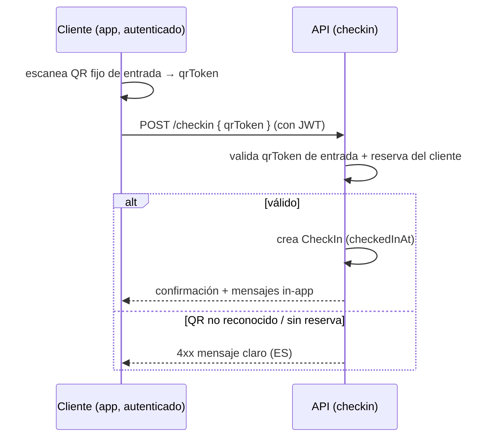
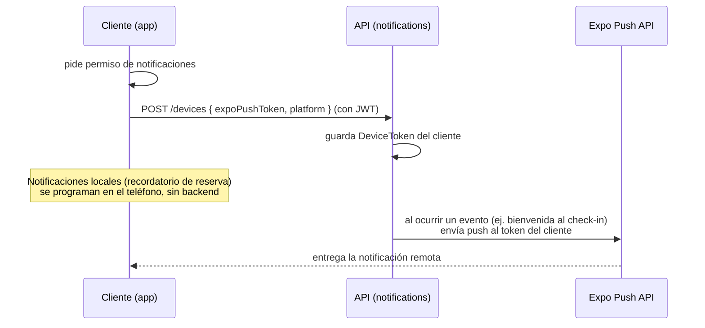

# Diseño técnico — Etapa 1 (Claro de Luna)

> Este documento define el **CÓMO** de la Etapa 1. La narrativa está en español;
> el código, identificadores, endpoints, tipos y contratos están en inglés.
> Las decisiones marcadas con **[VALIDAR]** requieren tu confirmación.

Requerimientos de referencia: [../features/README.md](../features/README.md)

---

## 1. Visión general de la arquitectura

Dos piezas desplegables + tipos compartidos, en un monorepo:



- **Contenido estático** (menú, huerta): vive **dentro de la app** como data quemada
  (decisión MVP), no en la base de datos.
- **Comunicación**: REST sobre HTTPS, autenticada con JWT.
- **Backend propio** (NestJS) desplegado en hosting free bajo **dominio propio**;
  la clienta solo instala la app, no levanta nada.
- **Push**: locales (recordatorios programados en el teléfono) + remotas (mensajes
  personalizados que el backend dispara vía Expo Push).

---

## 2. Stack tecnológico (propuesta con tradeoffs)

### 2.1 Mobile

| Decisión | Propuesta | Por qué | Alternativa / tradeoff |
|----------|-----------|---------|------------------------|
| Runtime RN | **Expo (managed)** | Cámara/QR, permisos, build y OTA listos; MVP más rápido | Bare RN: más control nativo, más fricción. No lo necesitamos aún |
| Navegación | **React Navigation** (native-stack + bottom-tabs) | Estándar de facto, tabs calzan con el menú principal (Mapa/Menú/Huerta/Staff) | expo-router: bueno, pero React Navigation es más maduro para tabs+stack anidados |
| Server state | **TanStack Query** | Cache, reintentos, estados de carga sin boilerplate | Redux Toolkit Query: más pesado para este scope |
| Client/UI state | **Zustand** | Mínimo, sin boilerplate, ideal para sesión/UI | Context puro: se queda corto; Redux: sobredimensionado |
| QR scanner | **expo-camera** | Integrado con Expo, permisos gestionados | react-native-vision-camera: más potente, pero bare |
| Mapa (plano propio) | **react-native-svg** + gesture-handler/reanimated | Plano vectorial con puntos interactivos, pan/zoom fluido | Imagen PNG + zoom: más simple pero puntos menos interactivos → depende del formato del plano **[VALIDAR]** |
| Formularios/validación | **react-hook-form + zod** | Validación tipada, reusa esquemas del backend | Validación manual: propensa a errores |
| Notificaciones | **expo-notifications** | Push locales (recordatorios) + remotas (Expo Push) sin SDK nativo extra | FCM/APNs directo: más setup nativo |

### 2.2 Backend

| Decisión | Propuesta | Por qué | Alternativa / tradeoff |
|----------|-----------|---------|------------------------|
| Framework | **NestJS** | Arquitectura por capas/módulos, escala, DI, class-validator | Express plano: menos estructura; Fastify: rápido pero menos batteries-included |
| Lenguaje | **TypeScript** (strict) | Tipos compartidos con la app | — |
| ORM | **Prisma** | Migraciones, tipos generados, DX | TypeORM: más verboso |
| Base de datos | **PostgreSQL** | Relacional, robusto para reservas/usuarios | SQLite: solo para dev/local |
| Auth | **JWT** (access + refresh) | Stateless, escala horizontal | Sesiones en DB: no escala tan simple |
| Email OTP | **Resend** (free tier: 3.000/mes) | Gratis, buena DX y entregabilidad; API simple | Brevo (300/día) o Gmail SMTP (no apto producción) |
| Push | **Expo Push API** (gratis) + expo-notifications | Remotas y locales sin costo, integra con Expo | FCM/APNs directo: más setup nativo |
| Hosting API | **Render / Fly.io** (free) + **dominio propio** | Despliegue gratis bajo tu dominio | Free tier duerme → cold start (ver Riesgos) |
| Postgres gestionado | **Neon** (free serverless) | Gratis y no se duerme como el web service | Render Postgres (free 90 días) |

### 2.3 Monorepo

```
claro-de-luna/
├── apps/
│   ├── mobile/            # React Native / Expo
│   └── api/               # NestJS
├── packages/
│   └── shared/            # DTOs / zod schemas / tipos compartidos
├── docs/
└── package.json           # workspaces (pnpm o npm)
```

**Confirmado**: monorepo con workspaces. Los tipos de los contratos se comparten
entre app y API y no se desincronizan.

---

## 3. Arquitectura de la app móvil

Capas claras, dependencias apuntando hacia adentro (presentación → dominio → infra):

```
apps/mobile/src/
├── app/                    # entry, providers (QueryClient, navigation, auth)
├── navigation/             # navigators (RootStack, MainTabs)
├── features/
│   ├── welcome/            # F01 — bienvenida
│   ├── auth/               # F01 — OTP login
│   ├── reservation/        # F01 — ver/crear reserva
│   ├── itinerary/          # F02 — mapa + recorrido
│   ├── checkin/            # F03 — escaneo QR
│   ├── menu/               # F04 — menú/huerta/staff
│   └── notifications/      # registro de push token + notificaciones locales
├── shared/
│   ├── ui/                 # componentes base (Button, Screen, Text)
│   ├── api/                # http client, interceptores JWT
│   ├── state/              # zustand stores (authStore)
│   └── content/            # data quemada (menú, huerta) — español
└── theme/                  # tokens: color, tipografía, espaciado
```

- Cada `feature/` es autocontenida: `screens/`, `components/`, `hooks/`, `api/`.
- **Contenido estático** en `shared/content/` como módulos TS tipados (fácil de
  migrar a API en el futuro sin tocar la UI).
- Textos de cliente en **español**; nombres de archivos/símbolos en **inglés**.

### Navegación



---

## 4. Arquitectura del backend

NestJS por módulos, cada uno en capas (controller → service/use-case → repository):

```
apps/api/src/
├── auth/                   # request-otp, verify-otp, refresh, logout
├── users/                  # perfil del cliente
├── reservations/           # crear / consultar reserva
├── checkin/                # registrar llegada por QR
├── itinerary/              # hitos del día por reserva
├── notifications/          # device tokens + envío de push (Expo Push)
├── mail/                   # envío de OTP por email (Resend)
├── common/                 # guards (JwtAuthGuard), filters, interceptors
├── prisma/                 # PrismaService, schema
└── config/                 # env, validación de configuración
```

---

## 5. Modelo de datos



- `OtpCode.codeHash`: se guarda el **hash** del código, nunca en texto plano.
- `Reservation.status`: `confirmed | completed | no_show` (sin cancel en esta fase).
- `DeviceToken`: guarda el Expo push token por dispositivo para enviar push remotas.
- Menú/huerta **no** son tablas: son data quemada en la app.

---

## 6. Contratos de API (borrador)

Todos bajo `/api/v1`. Los que requieren sesión usan `Authorization: Bearer <accessToken>`.

| Método | Endpoint | Auth | Descripción |
|--------|----------|------|-------------|
| POST | `/auth/request-otp` | No | Body `{ email }`. Genera y envía OTP. Respuesta genérica (no revela si el email existe) |
| POST | `/auth/verify-otp` | No | Body `{ email, code }`. Devuelve `{ accessToken, refreshToken, user }` |
| POST | `/auth/refresh` | Refresh | Rota tokens |
| POST | `/auth/logout` | Sí | Invalida el refresh token |
| GET | `/me` | Sí | Perfil del cliente autenticado |
| GET | `/reservations/me` | Sí | Reserva vigente del cliente |
| POST | `/reservations` | Sí | Body `{ date, time, partySize }`. Crea reserva |
| GET | `/itinerary` | Sí | Hitos del día para la reserva del cliente |
| POST | `/checkin` | Sí | Body `{ qrToken }`. Registra llegada (QR fijo de entrada) |
| POST | `/devices` | Sí | Body `{ expoPushToken, platform }`. Registra token para push remoto |
| DELETE | `/devices/:token` | Sí | Baja el token (logout / desinstalación) |

> Los DTOs y sus esquemas `zod` viven en `packages/shared` y se reusan en app y API.

---

## 7. Flujos críticos

### 7.1 Login por OTP (F01)



### 7.2 Check-in por QR fijo (F03)



> La seguridad del check-in recae en la **sesión JWT + reserva**, no en el QR
> (que es fijo y solo identifica el punto de entrada).

### 7.3 Notificaciones push (F03 / transversal)



- **Locales**: la app programa recordatorios en el dispositivo (funcionan offline).
- **Remotas**: el backend dispara mensajes personalizados vía Expo Push al token guardado.

---

## 8. Seguridad (OWASP-aware)

- **Rate limiting** en `request-otp` y `verify-otp` (por email + IP) contra fuerza bruta.
- **OTP**: expiración corta (5–10 min), un solo uso, hash almacenado, límite de intentos.
- **Enumeración de usuarios**: `request-otp` responde genérico sin revelar existencia del email.
- **JWT**: access token corto + refresh token rotado; secrets en variables de entorno.
- **Validación de entrada** en el boundary (class-validator / zod) en cada endpoint.
- **Transporte**: HTTPS obligatorio; CORS restringido al origen de la app.
- **Datos sensibles**: nunca loguear OTP ni tokens.

---

## 9. Decisiones tomadas

1. **Push notifications**: **dentro de Etapa 1** — locales (recordatorios) + remotas
   (mensajes personalizados vía Expo Push disparadas desde el backend).
2. **Formato del plano del predio**: **SVG interactivo** (puntos clicables, pan/zoom).
3. **Email OTP**: proveedor **gratis** — Resend (free tier) recomendado.
4. **Repositorio**: **monorepo** con workspaces.
5. **Backend**: **NestJS propio desde cero**, desplegado en hosting free bajo
   **dominio propio**; la clienta solo instala la app.
6. **Base de datos**: Postgres gestionado gratis (Neon recomendado).

### Pendiente de definir (no bloquea el arranque)

- Proveedor final de hosting (Render / Fly.io) y de Postgres (Neon / otro).
- Dominio a comprar.

## 10. Riesgos

- **Entregabilidad del OTP**: si el email tarda/cae en spam, degrada la experiencia.
  Mitigación: proveedor confiable (Resend) + reenvío con backoff.
- **Cold start del hosting free**: el web service gratis se duerme por inactividad → el
  primer request tras el reposo es lento. Mitigación: health-check periódico (cron
  externo) para mantenerlo despierto, o plan pago al escalar. Neon (Postgres) no sufre esto.
- **Costo del dominio**: el dominio propio tiene costo anual (asumido).
- **Plano propio (SVG)**: el diseño fino del Feature 02 queda supeditado a tener el asset SVG.
- **Data quemada**: cualquier cambio de menú requiere redeploy (asumido para MVP).
